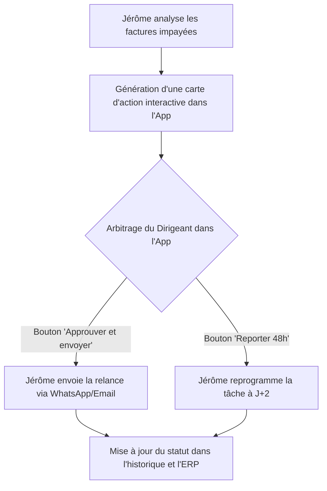

# Cas d'Usage et Workflows Métier de l'Écosystème

Ce document décrit les processus fonctionnels clés exécutés par la suite Hermès à travers ses différentes interfaces (Backend, Application Cliente PWA, et Portail de Supervision).

---

## 1. Workflows Trésorerie & Recouvrement (Jérôme)

### A. Détection des Retards et Balance Âgée
1. **Extraction** : Interrogation des factures échues non réglées depuis les connecteurs ERP (Pennylane, Sellsy, Odoo, ou import CSV).
2. **Calcul** : Calcul du retard en jours ($\text{Date du jour} - \text{Date d'échéance}$) et affectation aux tranches standard (0-15j, 16-30j, 31-60j, 61j+).
3. **Restitution** : Restitution instantanée sous forme de synthèse textuelle ou graphique dans l'App cliente lors de l'appel de la commande `/balance`.

### B. Validation des Relances en 1 Clic (Cartes d'Action Interactives dans l'App)
Dans l'application cliente `App_Hermes Core`, le dirigeant conserve le contrôle sans perdre de temps :

### C. Analyse de Solvabilité (Pappers & Open Data)
1. Requête automatique de la fiche entreprise par SIREN (via `/check <siren>`).
2. Interrogation gratuite du BODACC (recherche de procédures collectives actives).
3. Interrogation Pappers pour les comptes annuels, le ratio d'endettement et le score financier.
4. Synthèse crédit avec préconisation d'un montant d'encours maximal autorisé.

---

## 2. Workflows Commerciaux & Prospection (Lucas)

### Qualification de Leads Entrants
1. Réception d'un lead (formulaire web ou message prospect).
2. **Enrichissement** : Lucas interroge la base Sirene pour valider le secteur d'activité, les effectifs et la solvabilité de l'entreprise prospecte.
3. **Scoring BANT** : Qualification du besoin et de l'adéquation avec les offres de la PME.
4. **CRM Sync** : Création automatique de la fiche contact et de l'opportunité commerciale dans le CRM connecté.

---

## 3. Workflows Support & Escalade 24/7 (Clara)

### Résolution et Escalade Intelligente
1. Le client pose une question technique ou commerciale via le chat.
2. Clara effectue une recherche sémantique dans la documentation d'entreprise et répond avec précision.
3. **Détection d'anomalie** : Si le client formule une réclamation bloquante ou si le sentiment détecté est très négatif, Clara :
   * Ouvre immédiatement un ticket d'incident prioritaire.
   * Génère une notification d'astreinte pour le responsable support avec l'historique pré-analysé.

---

## 4. Workflows Marchés Publics & Appels d'Offres (Victor)

### Dépouillement de DCE et Structuration de Mémoire
1. Détection automatique d'une consultation sur le BOAMP correspondant aux mots-clés de la PME.
2. Lecture du Règlement de Consultation (RC) et du CCTP par Victor.
3. Extraction automatique de :
   * La date et heure limites de remise des plis.
   * Le barème de notation (Prix vs Valeur Technique).
   * La liste des pièces administratives obligatoires (DC1, DC2, attestations).
4. Génération du plan détaillé du mémoire technique personnalisé pour l'entreprise.

---

## 5. Workflow de Supervision Télémétrique (`Site_Hermes-core` / `monitoring.html`)

Afin de superviser la bonne santé opérationnelle de la flotte :
1. Les conteneurs d'agents exportent en continu leurs métriques d'utilisation (tokens, requêtes, coûts réels vs estimés).
2. La page `monitoring.html` agrège ces données sous forme de graphiques dynamiques Chart.js.
3. **Système de surveillance visuel** :
   * Badge vert `🟢 Opérationnel` : Métriques stables, taux d'erreur < 1%.
   * Badge rouge `🔴 Erreur Critique` : Détection automatique d'une clé API expirée ou d'un conteneur injoignable avec journalisation immédiate dans l'interface admin.
