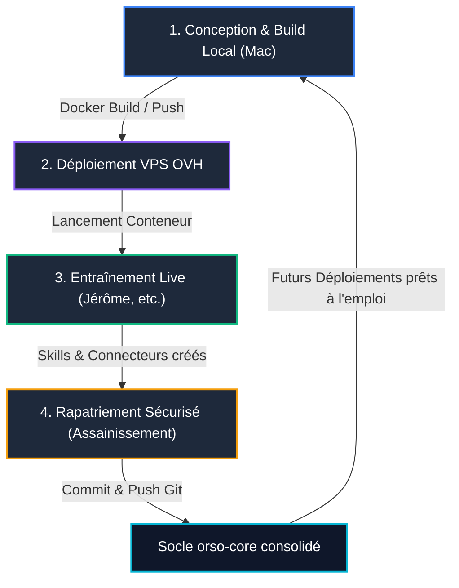

# Cycle de Vie des Agents Orso : Conception, Déploiement & Rapatriement Continu

Ce document formalise et détaille le **processus de collaboration itératif** entre l'environnement de développement local (Mac), le conteneur en production/recette sur le VPS (OVH), l'entraînement en conditions réelles, et le rapatriement assaini des compétences vers le dépôt source `orso-core`.

---

## 1. Vue d'Ensemble du Cycle en 4 Phases



### Principes Directeurs
1. **L'entraînement a lieu sur le terrain (VPS)** : Le chef d'entreprise interagit avec l'agent, lui apprend son métier, fait créer des connecteurs (Odoo, Cegid, Sellsy) et affine ses mémoires (`USER.md`).
2. **Le rapatriement est continu et asynchrone** : Dès qu'un palier d'apprentissage est atteint, les compétences sont réintégrées dans `orso-core`.
3. **La règle inviolable d'assainissement (Sécurité par Design)** :
   - ✅ **Ce qui est rapatrié** : Le code, les scripts, les définitions de skills (`SKILL.md`), la personnalité (`SOUL.md`), les mémoires de travail génériques (`USER.md`).
   - 🚫 **Ce qui n'est JAMAIS rapatrié** : Les fichiers d'environnement (`.env`), les clés d'API de production, les mots de passe de bases ERP réelles (ex: mot de passe Odoo).
   - 🛡️ **Bénéfice** : Lorsqu'un nouvel agent est déployé pour un nouveau client ou une nouvelle instance, il embarque d'office toutes les capacités techniques (il sait comment interroger Odoo), mais **sans aucune connexion ouverte par défaut**. L'accès au SI du client se fait par configuration explicite et sécurisée.

---

## 2. Phase 1 : Conception & Build Local (Mac)

Sur le Mac de développement, nous créons ou mettons à jour l'image Docker de l'agent.

### Commandes de Build
```bash
cd "/Users/tquinzain/Documents/Dev Projects/orso-core"

# 1. Construction de l'image Docker unifiée
docker build -t orso-agent:latest -f Dockerfile.orso .

# 2. Tag pour votre registre privé ou transfert direct
docker tag orso-agent:latest registry.orso-agents.fr/orso-agent:latest
```

*(Alternative sans registre privé : export en archive tar pour transfert direct)*
```bash
docker save orso-agent:latest | gzip > orso-agent-latest.tar.gz
```

---

## 3. Phase 2 : Déploiement & Exécution sur le VPS OVH

Sur le VPS OVH, le conteneur tourne avec des volumes persistants afin que les données d'apprentissage ne soient pas écrasées lors des mises à jour.

### Structure Recommandée sur le VPS
```
/opt/orso/
├── docker-compose.yml
├── .env                  # Clés d'API injectées au runtime (OpenRouter, etc.)
└── data/
    └── profiles/
        └── jerome/       # Persistance du profil (skills, memories, state.db)
```

### Exemple de `docker-compose.yml` sur le VPS
```yaml
services:
  orso-jerome:
    image: orso-agent:latest
    container_name: orso_jerome_live
    restart: unless-stopped
    ports:
      - "9119:9119"       # API Backend & Dashboard
      - "9300:9300"       # UI Client PWA
    environment:
      - OPENROUTER_API_KEY=${OPENROUTER_API_KEY}
      - HERMES_HOME=/app/profiles/jerome
      - ODOO_URL=${ODOO_URL}
      - ODOO_DB=${ODOO_DB}
      - ODOO_USER=${ODOO_USER}
      - ODOO_PASSWORD=${ODOO_PASSWORD}
    volumes:
      - ./data/profiles/jerome:/app/profiles/jerome
```

---

## 4. Phase 3 : Entraînement & Spécialisation Live (VPS)

Depuis l'interface Web ou par messagerie (Telegram / WhatsApp / PWA), vous conversez avec Jérôme :
- *"Jérôme, tu es désormais en charge du recouvrement pour notre entreprise..."*
- *"Crée un connecteur pour interroger notre base de test Odoo..."*
- L'agent utilise ses outils autonomes (`skill_manage`, `write_file`) pour générer ses compétences dans `/app/profiles/jerome/skills/credit-management/erp-connectors/`.
- Ces fichiers sont immédiatement persistés sur le disque de l'hôte OVH via le montage de volume.

---

## 5. Phase 4 : Rapatriement Sécurisé & Assainissement

Lorsque vous revenez sur votre Mac et souhaitez intégrer ces nouvelles compétences au projet :

### Rapatriement Automatisé via le Skill `sync-agent-skills`
Exécutez simplement la commande de rapatriement :
```bash
python -m skills.devops.sync-agent-skills.scripts.repatriate_agent \
  --source "root@vps-ovh.orso-agents.fr:/opt/orso/data/profiles/jerome" \
  --agent jerome \
  --sanitize
```

### Opérations exécutées automatiquement par le script :
1. **Extraction** : Récupération des skills (`skills/`), mémoires (`memories/USER.md`) et configuration d'âme (`SOUL.md`).
2. **Filtrage des Secrets** :
   - Les fichiers `.env` sont ignorés.
   - Les clés privées (`sk-or-v1-...`, mots de passe Odoo, etc.) sont expurgées.
   - Si de nouvelles variables sont requises par les nouveaux skills (ex: `ODOO_URL`), elles sont automatiquement documentées dans un fichier `.env.example` avec des valeurs neutres.
3. **Consolidation** :
   - Mise à jour du profil de base dans `profiles/jerome/`.
   - Copie des skills réutilisables dans le catalogue global `skills/`.
4. **Validation** : Les tests unitaires s'assurent qu'aucune régression ou fuite de secrets n'a eu lieu.

---

## 6. Phase 5 : Clôture & Diffusion

Une fois rapatrié :
```bash
git status
git add skills/ profiles/jerome/
git commit -m "feat(skills): rapatriement des compétences Jérôme depuis le VPS live"
git push origin main
```

Désormais, tout nouveau conteneur ou nouvel agent déployé pour un futur client disposera d'emblée des connecteurs et compétences éprouvés sur le terrain, en toute sécurité.
