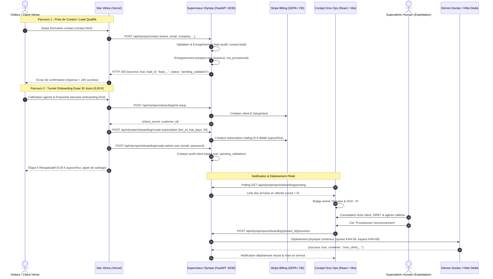

# Spécification Technique KAN-45 : Parcours d'Achat Vitrine, Notification Ops & Déploiement Piloté

> **Date** : 05/10/2026  
> **Auteur** : Antigravity (Architecte Projet)  
> **Destinataires** : Jarvis (PO), Thibaut (Direction)  
> **Ticket Jira associé** : [KAN-45](https://orso-agents.atlassian.net/browse/KAN-45)  
> **Statut** : Validé suite à l'arbitrage Direction du 05/10/2026.

---

## 1. Contexte & Arbitrage Formel de la Direction

Le ticket **KAN-45** a soulevé la question de l'arbitrage commercial et architectural entre :
1. **La souscription autonome depuis la vitrine avec auto-déploiement direct** de l'environnement conteneurisé.
2. **La souscription vitrine avec notification OPS et déploiement piloté** depuis le backoffice d'exploitation.

### Arbitrage Direction (05/10/2026) :
> **« Souscription autonome depuis la vitrine vs Création client pilotée depuis le Cockpit Ops » : on ne fait pas de création autonome en direct. Une notification/alerte arrive sur OPS et le superadmin lance la création de l'environnement client depuis ce backoffice.**

Cet arbitrage s'aligne rigoureusement sur les principes de sécurité et de contrôle des coûts établis par les chantiers **KAN-44** (découplage strict entre webhooks et activation physique) et **KAN-74** (délégation du provisioning machine contrôlée et rejet des activations aveugles).

---

## 2. Architecture & Flux Opérationnel

---

## 3. Détail des Composants Techniques

### 3.1. Vitrine Publique (`Site_Hermes-core` / `orso-site`)
* **`contact.html`** :
  * Formulaire interactif complet : nom, email professionnel, entreprise, téléphone direct, agent sélectionné, message, consentement RGPD.
  * Transmission réelle par appel API asynchrone : `POST https://ops.orso-agents.fr/api/olympe/contact` (ou `http://localhost:9230/api/olympe/contact` en local).
  * Affichage réactif de l'accusé de réception avec confirmation de l'adresse de réponse (< 24h ouvrées).
  * Email officiel de contact : `contact@orso-agents.fr` (serveurs MX OVH joignables).
* **`vercel.json`** :
  * Activation de `"cleanUrls": true` assurant que `/contact` et `/tarifs` répondent sans 404.
* **`index.html` & `tarifs.html`** :
  * Tous les boutons CTA ("Démarrer l'essai 30 jours", "Sélectionner Jérôme", etc.) orientent vers `onboarding.html?agents=...`.
  * Le bouton "Contacter un expert" mène à `contact.html`.

### 3.2. Moteur & Superviseur Olympe (`orso-core`)
* **`POST /api/olympe/contact` (`olympe/server.py`)** :
  * Endpoint public protégé par CORS `*`.
  * Valide `ContactFormRequest`.
  * Appelle `ops_manager.record_contact_lead()`.
* **`OpsManager.record_contact_lead` (`olympe/ops_manager.py`)** :
  * Enregistre l'événement d'audit (`contact:lead`) dans le journal OPS.
  * Crée une entrée d'organisation en attente (`status: "trial"`, `instance.environment_status: "pending_validation"`, `instance.status: "not_provisioned"`).
  * Remonte immédiatement dans `get_pending_onboarding()`.
* **Alignement DNS MX (`olympe/auth.py`, `olympe/server.py`, `olympe/ops_manager.py`)** :
  * Remplacement systématique du sous-domaine fantôme `@test.orso-agents.fr` (aucun MX/A) par le domaine officiel joignable `@orso-agents.fr`.

### 3.3. Cockpit Orso Ops (`apps/ui-ops`)
* **Badge Navbar "Arrivées & OVH"** :
  * Affiche le nombre d'arrivées en attente (`pendingOnboardingCount > 0`) avec animation visuelle d'alerte.
* **Vue Onboarding (`OnboardingView.tsx`)** :
  * Filtre `pending` présentant la liste des prospects et souscriptions d'essai.
  * Bouton d'action explicite pour lancer le provisioning d'infrastructure (`onProvisionTenant`).

---

## 4. Matrice de Conformité aux Critères KAN-45

| Critère | Exigence du ticket | Implémentation & Preuve |
| :--- | :--- | :--- |
| **CA1** | Souscription en environnement de test sans intervention manuelle | Cycle complet `/init-setup` $\rightarrow$ `/create-subscription` (30j trialing) $\rightarrow$ `/create-admin-user`. 100% automatisé, environnement en attente d'arbitrage. |
| **CA2** | Client, abonnement et environnement créés et vérifiables en base | Organisation retrouvée par `get_tenant_detail(slug)` avec abonnement `trialing`/`pending_validation` et instance `not_provisioned`/`pending_validation`. |
| **CA3** | Page de confirmation affichant l'état réel | Étape 5 d'`onboarding.html` avec sélecteurs réels (`recap_company_name`, montant à 0,00 € aujourd'hui, 30 jours d'essai actif). |
| **CA4** | Messages routés vers une boîte de test joignable (fin de `test.orso-agents.fr`) | Domaine `@orso-agents.fr` vérifié par sonde DNS MX (OVH `mail.ovh.net`). Rejet strict de tout résidu `test.orso-agents.fr`. |
| **CA5** | Page de contact conforme, transmettrice et fonctionnelle | `contact.html` avec appel `POST /api/olympe/contact`, `cleanUrls: true` dans `vercel.json` (fin de la 404), notification immédiate dans le Cockpit Ops. |
